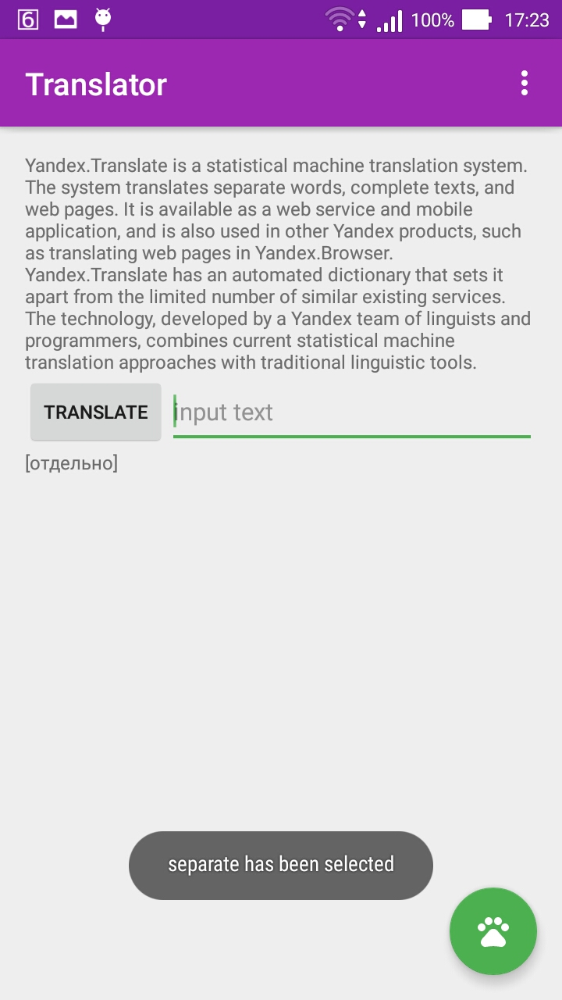

# Pet Project

Translating TXT, Working with Yandex Translator API

Using Dagger2, Retrofit, RxJava (Learning)

  

Good Articles:

<a href="https://medium.com/@nurrohman/a-simple-android-apps-with-mvp-dagger-rxjava-and-retrofit-4edb214a66d7#.ijmnkqzgn">A Simple Android Apps with MVP, Dagger, RxJava, and Retrofit</a> 
<a href="http://www.jsonschema2pojo.org/">Generate POJO from JSON or JSON</a> 
<a href="https://github.com/codepath/android_guides/wiki/Dependency-Injection-with-Dagger-2">Dependency Injection with Dagger 2</a> 
<a href="https://krtkush.github.io/2016/06/01/caching-using-okhttp-part-1.html">Response caching using OkHttp</a>
